# Báo cáo cá nhân — K4-L3B Day 13 Monitoring & LLMOps

> Mỗi học viên hoàn thiện một file duy nhất này. Khi dẫn evidence, dùng đường dẫn tương đối, ví dụ `evidence/07-trace-waterfall.png`.

## 1. Thông tin học viên

- **Họ và tên:** Nguyễn Tiến Lượng
- **MSSV:** 2A202602378
- **Lớp:** K4-L3B
- **Repository URL:** https://github.com/Luongday/K4-L3B-DAY13-NguyenTienLuong-2A202602378-Monitoring-LLMOps.git
- **Commit SHA cuối:**
- **Challenge ID:** `day13-k4-l3b-monitoring-llmops-v1` (cohort K4)
- **Tên project Langfuse cá nhân:** `day13-k4-l3b-2A202602378`

## 2. Evidence index

Điền đúng đường dẫn tới evidence thực tế. Có thể đổi tên hoặc dùng nhiều ảnh nếu cần.

| Evidence | Ảnh (theo hướng dẫn CP4) | Dữ liệu text kèm theo |
|---|---|---|
| 01 Pytest cuối | `evidence/01-pytest.png` | `evidence/01-pytest.txt` |
| 02 Log validator | `evidence/02-log-validator.png` | |
| 03 Dashboard validator | `evidence/03-dashboard-validator.png` | `evidence/03-dashboard-validator.txt` |
| 04 Structured log | `evidence/04-structured-log.png` | |
| 05 PII redaction | `evidence/05-pii-redaction.png` | |
| 06 Trace list | `evidence/06-trace-list.png` | `evidence/06-trace-list.txt` |
| 07 Trace waterfall | `evidence/07-trace-waterfall.png` | |
| 08 Trace metadata | `evidence/08a-trace-metadata.png`, `evidence/08b-generation-metadata.png` | |
| 09 Prompt versions | `evidence/09-prompt-versions.png` | `evidence/09-10-prompt-versions-and-rollback.txt` |
| 10 Prompt promote / rollback | `evidence/10a-prompt-promote.png`, `evidence/10b-prompt-rollback.png` | `evidence/09-10-prompt-versions-and-rollback.txt` |
| 11 Dashboard runtime | `evidence/11-dashboard-overview.png` | |
| 12 Incident metric | `evidence/12-incident-metric.png` | `evidence/12-incident-metric.txt` |
| 13 Incident log | `evidence/13a-incident-filter.png`, `evidence/13b-incident-log.png` | `evidence/13-incident-log.txt` |
| 14 Incident trace | `evidence/14-incident-trace.png` | `evidence/14-incident-trace.txt` |

Baseline ban đầu (trước khi sửa code): `evidence/00-baseline.txt`.

## 3. Kết quả kỹ thuật

| Nội dung | Baseline | Kết quả cuối | Nhận xét |
|---|---|---|---|
| `validate_logs.py` | 30/100 (correlation_id = `MISSING`, thiếu enrichment) | 100/100 (21 record, 10 correlation ID, 0 PII leak, trên log mới sau khi chuyển log cũ ra ngoài) | Baseline: `evidence/00-baseline.txt`; cuối: `evidence/02-log-validator.png` |
| `validate_dashboard.py` | 6/6 panel hợp lệ | 6/6 panel hợp lệ | Chỉ kiểm tra contract YAML; dashboard runtime chạy bằng `scripts/dashboard.py` |
| `pytest` | 22 passed | 50 passed | `evidence/01-pytest.txt` |
| Số traces hợp lệ | 10 trace, chỉ có root `lab-agent-run` | 17 trace có root + retrieval + generation từ 2 lần `load_test.py`, cộng 12 trace cho prompt v1/v2 | `evidence/06-trace-list.txt`, `evidence/09-10-prompt-versions-and-rollback.txt`; 3 request bị loại vì mạng tới Langfuse rớt. Ngoài ra CP3 tạo thêm 25 trace đủ span. Quét toàn bộ 289 observation trong project: 0 PII thô |
| Số PII leak | 0 | 0 (đã scrub ở processor, xem `evidence/05-pii-redaction.png`) | `summarize_text` đã scrub preview; `scrub_event` chưa đăng ký |
| Latency P95 / TTFT P95 | 1605 ms / 50 ms | P50 151 ms, P95 152 ms, TTFT P95 50 ms (phút baseline 05:08 và sau khi khắc phục 05:10); 2653 ms trong sự cố 05:09 | `evidence/12-incident-metric.txt`; baseline đầu bài lấy từ `/metrics`. Khi mạng tới Langfuse rớt, một request từng bị treo 14 s vì DNS chặn bước lấy prompt |
| Retrieval success rate | 100% (10/10) | 100% (25/25) | Từ `tool_success` trong log, ba phút 05:08–05:10 |

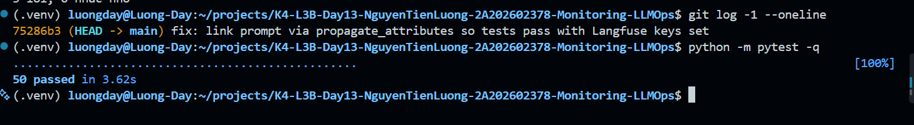
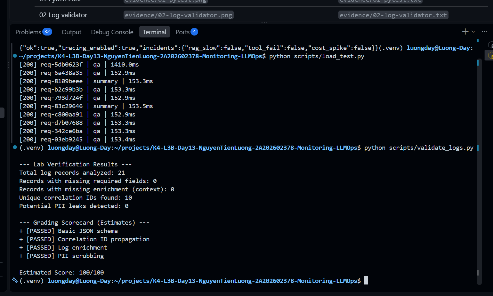
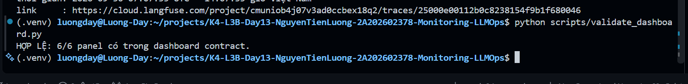

## 4. Logging và PII

- **Cách tạo/nhận và truyền correlation ID:** `CorrelationIdMiddleware` ([app/middleware.py](../app/middleware.py)) chạy đầu mỗi request: `clear_contextvars()` để không rò context giữa các request, đọc header `x-request-id`, chỉ nhận khi khớp `[A-Za-z0-9._-]{1,64}` và không bị `scrub_text` đổi (tránh ID chứa email hoặc số điện thoại); nếu không hợp lệ thì sinh `req-<8 hex>`. ID được `bind_contextvars` nên mọi dòng log trong request đều có `correlation_id`, được lưu vào `request.state` để đưa vào metadata trace Langfuse, và được trả lại qua header `x-request-id` cùng `x-response-time-ms` (kể cả response 500).
- **Các metadata được ghi vào structured log:** `correlation_id`, `user_id_hash` (SHA-256 cắt 12 ký tự, không log `user_id` thô), `session_id`, `feature`, `model`, `env`, được bind ở `/chat` trước dòng `request_received` ([app/main.py](../app/main.py)). Dòng `response_sent` thêm `latency_ms`, `ttft_ms`, `tokens_in`, `tokens_out`, `cost_usd`, `quality_score`, `tool_name`, `tool_success`; dòng `request_failed` thêm `error_type`.
- **Cách bảo đảm PII được scrub trước khi ghi:** processor `scrub_event` ([app/logging_config.py](../app/logging_config.py)) được đăng ký sau `format_exc_info` và ngay trước `JsonlFileProcessor` và `JSONRenderer`, nên dữ liệu được che trước khi serialize và ghi ra file hoặc stdout. Nó scrub đệ quy mọi field dạng chuỗi (payload lồng nhau, field top-level, cả traceback) bằng bốn pattern trong [app/pii.py](../app/pii.py): email, điện thoại Việt Nam, CCCD, thẻ thanh toán. Hai field do server sinh (`ts`, `user_id_hash`) được bỏ qua vì một hash toàn chữ số dài 12 ký tự sẽ bị nhận nhầm là CCCD. Preview đưa vào log và trace đều đi qua `summarize_text` (scrub và cắt 80 ký tự), và root span tắt `capture_input` và `capture_output`.
- **Cách kiểm chứng kết quả:** 50 test (gồm [tests/test_correlation_logging.py](../tests/test_correlation_logging.py) và [tests/test_pii.py](../tests/test_pii.py)); `validate_logs.py` tăng từ 30/100 (baseline) lên 100/100 (`evidence/02-log-validator.png`); grep `data/logs.jsonl` không còn PII giả (`evidence/05-pii-redaction.png`); quét toàn bộ 289 observation trong project Langfuse cho 0 PII thô và 35 observation có marker `[REDACTED_*]`, chứng tỏ scrub đã chạy trên các câu hỏi chứa PII.

- **ID request dùng cho evidence 04, 07, 08a:** `req-04a1b2c3`; evidence 05: `req-05a1b2c3`.

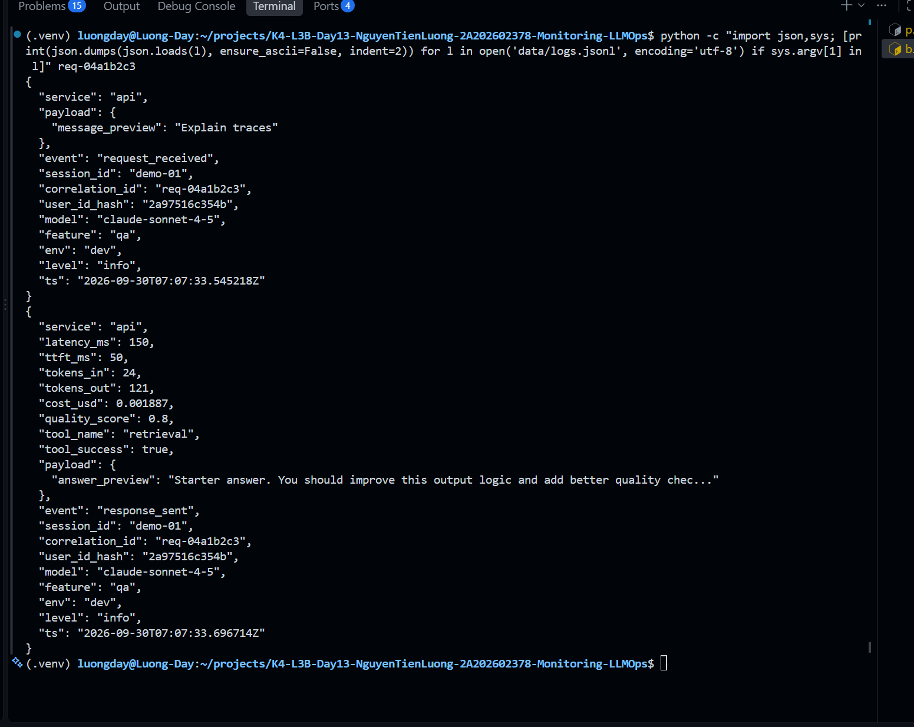
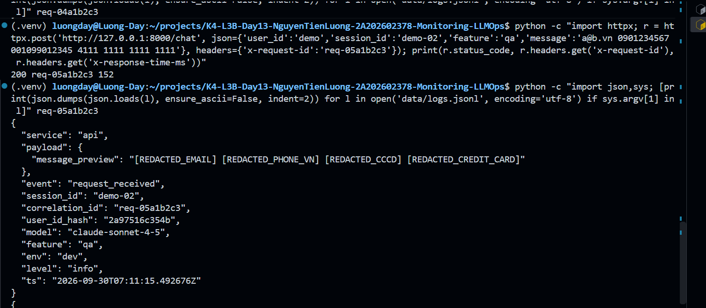

## 5. Tracing và prompt versioning

- **Cách xác nhận traces do chính tôi tạo trong project cá nhân:** key trong `.env` thuộc project `day13-k4-l3b-2A202602378` (`auth_check()` trả `True`); mọi trace sinh ra từ workload tôi tự chạy (`load_test.py` và các request có `x-request-id` do tôi đặt) và nối được với log bằng `correlation_id`. `evidence/06-trace-list.txt` liệt kê 17 trace đủ span từ hai lần `load_test.py`; prompt v1/v2 thêm 12 trace; CP3 thêm 25 trace.
- **Cấu trúc root/retrieval/generation observations:** `lab-agent-run` (AGENT, root) có hai con. `retrieval` (RETRIEVER): input là preview đã scrub, output `doc_count`, khi lỗi có level `ERROR` và `status_message`. `llm-generation` (GENERATION): model `claude-sonnet-4-5`, `usage_details` input/output, `cost_details` input/output/total theo 3 và 15 USD mỗi triệu token, `completion_start_time` bằng thời điểm bắt đầu cộng TTFT, và link tới prompt managed. Code ở [app/agent.py](../app/agent.py) và helper `observation()` trong [app/tracing.py](../app/tracing.py); test ở [tests/test_agent_child_observations.py](../tests/test_agent_child_observations.py).
- **Cách nối trace với log:** `correlation_id` (chính là `x-request-id`) nằm trong `metadata` của root span (qua `propagate_attributes`) và trong mọi dòng log của request. Ví dụ `req-12aa2e37` trong log ↔ trace `ce9a43b8d713d3575cf8a6048280e89b` trên Langfuse.
- **Prompt name:** `day13-chat`
- **Version/label baseline:** version 1, labels `baseline` và `production`, nội dung đúng ba dòng `Feature`, `Docs`, `Question` theo prompt contract.
- **Version/label candidate:** version 2, label `candidate`, thêm dòng đầu "Answer in at most three concise sentences." nên input token tăng từ 25 lên 36.
- **Trace ID của mỗi version:** v1 (label `baseline`): `fe68ee694c883734b1297bd2b32269de`; v2 (label `candidate`): `f4eb24d925fb993d85dc786e3e55925a`; `production` trước khi promote (v1): `aa14795eeddee8bea433a38138f782ec`; sau promote (v2): `7d89634a5bcb7455f6e63d1b45f7fbb2`; sau rollback (v1): `b412be6775aae2d88d51cf3faba342dc`. Danh sách đầy đủ trong `evidence/09-10-prompt-versions-and-rollback.txt`.
- **Cách promote và rollback `production`:** chuyển label `production` sang version 2 lúc 04:51:49 UTC rồi về version 1 lúc 04:53:38 UTC bằng `langfuse.update_prompt(name="day13-chat", version=..., new_labels=["production"])`, cùng thao tác với đổi label trên giao diện. App không đổi code, chỉ đọc `LANGFUSE_PROMPT_LABEL=production`. SDK cache prompt 60 giây và trả bản cũ một lần sau khi hết TTL rồi mới refresh nền, nên tôi đợi hơn 60 giây và gửi một request khởi động trước khi lấy trace làm bằng chứng; trace ghi đúng version 2 sau promote và version 1 sau rollback.

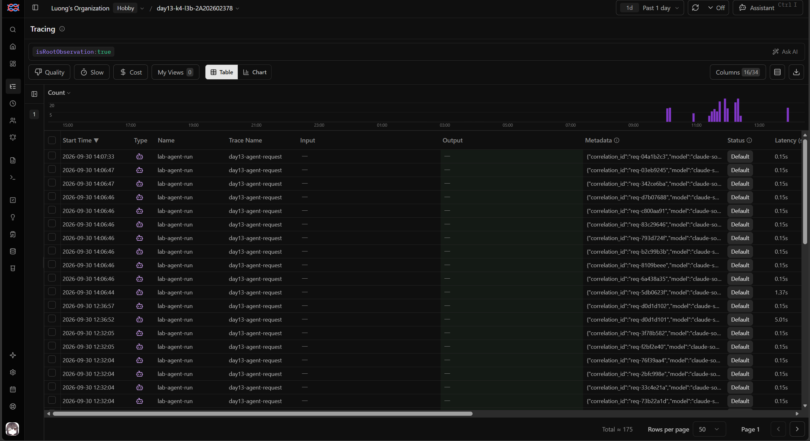
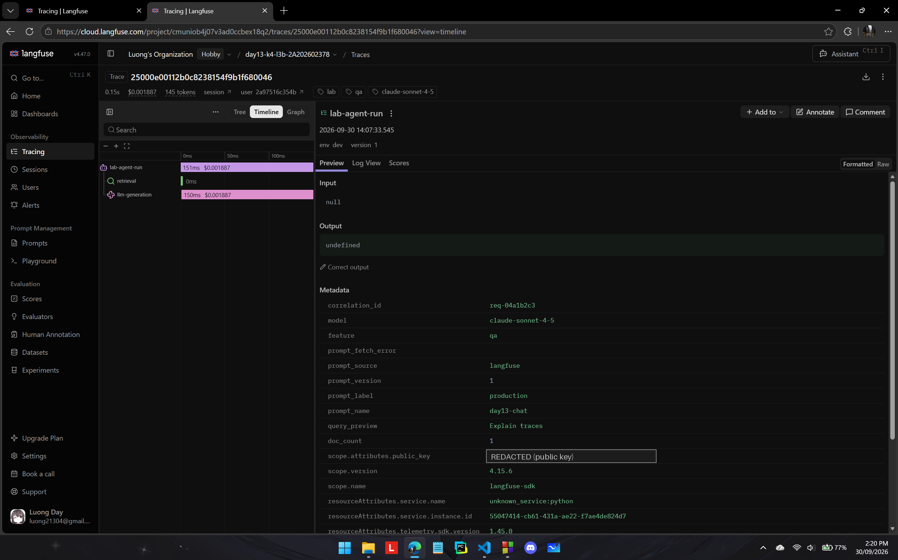
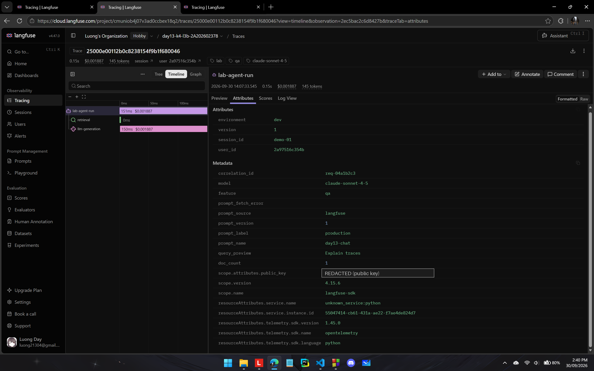
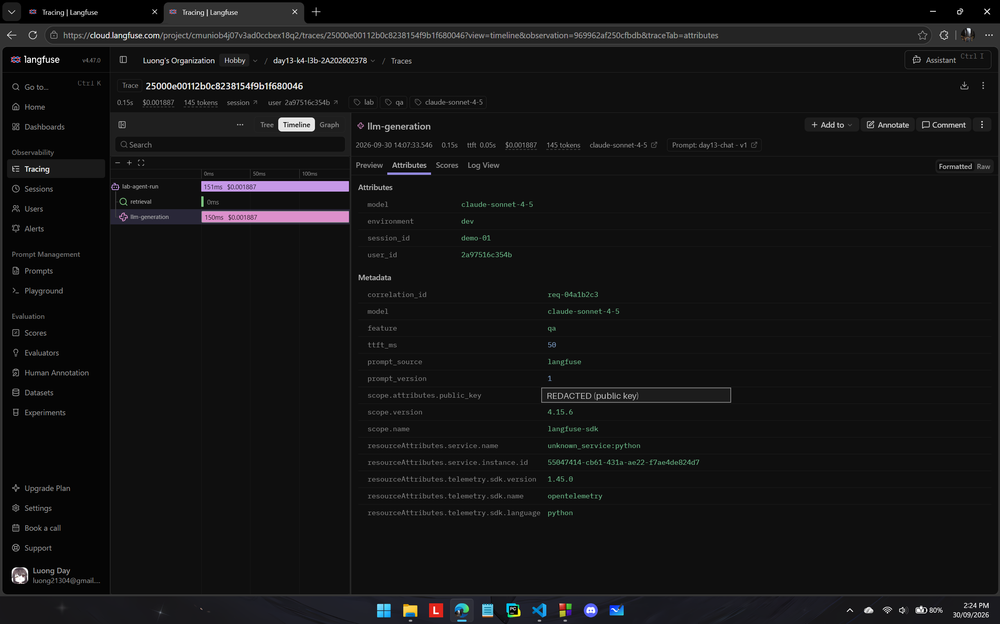
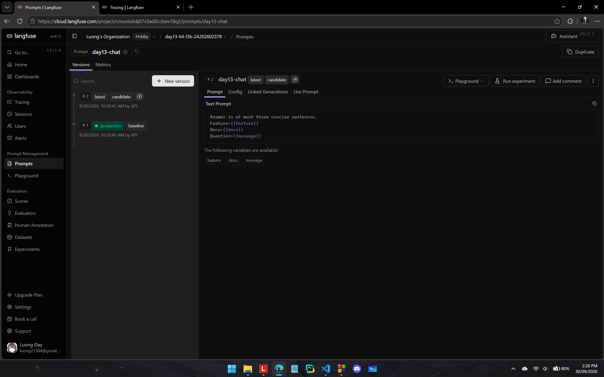
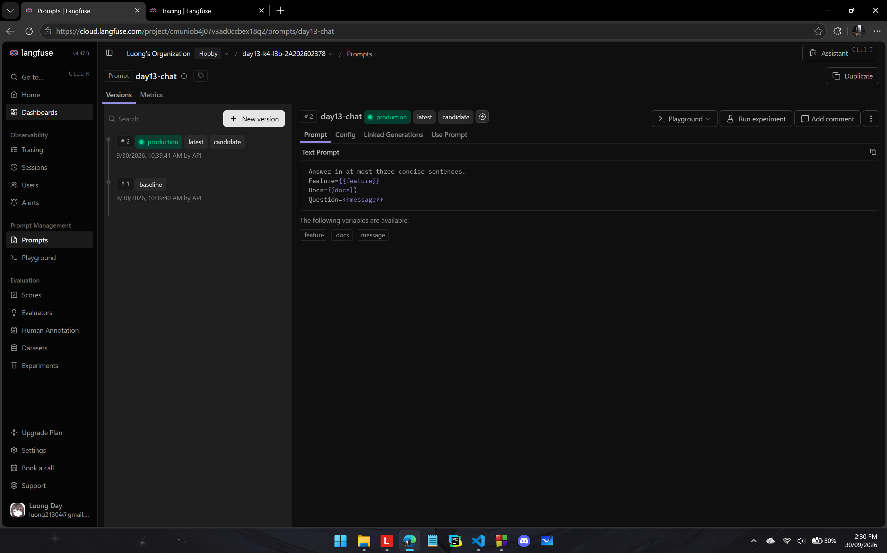
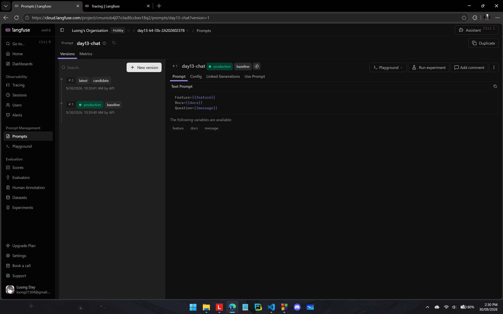

## 6. Dashboard, SLO và alerts

- **Dashboard và sáu panel:** `scripts/dashboard.py` (chỉ dùng thư viện chuẩn) đọc `data/logs.jsonl` và `config/dashboard.yaml`; cửa sổ 60 phút, refresh 30 giây, mỗi panel có đơn vị, đường threshold, tooltip và bảng dữ liệu. Sáu panel: Latency (P50/P95/P99 và TTFT P95, SLO P95 ≤ 3000 ms), Traffic (≥ 1 request/phút), Errors (error rate ≤ 2%, retrieval success với guardrail ≥ 90%, breakdown theo `error_type`), Cost (tổng ≤ $2.5), Tokens (≤ 50,000 mỗi field), Quality (mean ≥ 0.75). Ảnh baseline: `evidence/11-dashboard-overview.png`; ảnh khi có sự cố: `evidence/12-incident-metric.png`. Cách chạy ở [docs/DASHBOARD_SETUP.md](../docs/DASHBOARD_SETUP.md).
- **SLO và lý do chọn:** `fast_successful_requests`: 99.5% request có `response_sent` với `latency_ms ≤ 3000` trên tổng `request_received` trong 28 ngày ([config/slo.yaml](../config/slo.yaml)). Từ baseline: request bình thường 150–600 ms, request khởi động lạnh 1.6–2.9 giây, 0% lỗi, nên 3000 ms và 99.5% khả thi. Hạn chế đã gặp: sự cố `rag_slow` và challenge chỉ đạt 2652 ms, dưới ngưỡng, nên SLO không phát hiện; tôi bổ sung alert cảnh báo sớm ở 2000 ms.
- **Cách tính error budget:** 100% − 99.5% = 0.5%. Với 10,000 request trong 28 ngày, tối đa 50 request được phép lỗi hoặc chậm hơn 3000 ms; request thứ 51 làm cạn budget.
- **Ba alert và runbook tương ứng:** cả ba gửi Slack `#k4-l3b-alerts`, owner `student-2A202602378`, runbook ở [docs/alerts.md](../docs/alerts.md) ([config/alert_rules.yaml](../config/alert_rules.yaml)). (1) `HighLatencyP95`, warning: `p95(latency_ms) > 2000` trong 5 phút, [runbook](../docs/alerts.md#alert-1). (2) `HighErrorRateOrRetrievalFailure`, critical: `error_rate_pct > 2` hoặc `retrieval_success_rate_pct < 90` trong 3 phút, [runbook](../docs/alerts.md#alert-2). (3) `CostPerRequestSpike`, warning: `avg(cost_usd) > 0.004` hoặc tổng cost 1 giờ `> 2.5` trong 10 phút, [runbook](../docs/alerts.md#alert-3). Ba alert khớp ba practice scenario (`rag_slow`, `tool_fail`, `cost_spike`) và mỗi runbook có ba bước kiểm tra theo chuỗi metric, log, trace.

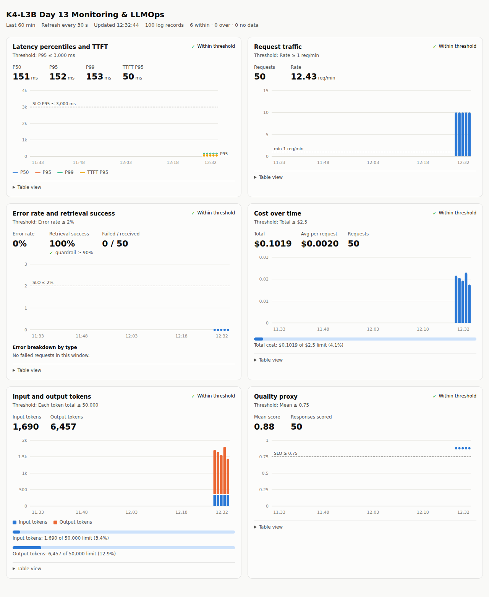

> Ví dụ cách viết error budget: "SLO 99.5% trong 28 ngày nghĩa là error budget 0.5%. Nếu workload có 10,000 request thì tối đa 50 request được phép lỗi hoặc chậm hơn ngưỡng SLO."

## 7. Điều tra challenge

- **Challenge ID:** `day13-k4-l3b-monitoring-llmops-v1` (cohort K4), file `config/challenge.json` do Lab Coach gửi, không sửa và không commit.
- **Khoảng thời gian điều tra:** 05:09:04–05:09:18 UTC (12:09 giờ Việt Nam) trên lần chạy có tách phút: 05:08 baseline (incident tắt), 05:09 challenge (`load_test.py --challenge --concurrency 5`), 05:10 sau khi khắc phục. Lần chạy đầu cho kết quả giống hệt (retrieval 2500–2501 ms) nhưng baseline và challenge rơi vào cùng một phút nên tôi chạy lại để biểu đồ tách được. Xem `evidence/12-incident-metric.png`, `evidence/12-incident-metric.txt`.
- **Triệu chứng từ metrics:** chỉ latency lệch. `latency_ms` P50/P95 tăng từ 151/151 ms (05:08) lên 2652/2653 ms (05:09), khoảng 17 lần, rồi về 151/152 ms (05:10). TTFT P95 giữ 50 ms; token và cost mỗi request, quality (0.84–0.88), error rate 0% và retrieval success 100% không đổi. Vì TTFT không đổi mà tổng thời gian tăng khoảng 2.5 giây nên phần chậm nằm trước bước LLM bắt đầu trả lời. Lưu ý panel latency vẫn hiện "Within threshold" vì 2653 ms < SLO 3000 ms; alert cảnh báo sớm `HighLatencyP95` (> 2000 ms trong 5 phút) mới bắt được sự cố này.
- **Log line và correlation ID liên quan:** `correlation_id=req-12aa2e37`: `request_received` lúc 05:09:04.301, `response_sent` lúc 05:09:06.955 với `latency_ms=2652`, `ttft_ms=50`, `tool_success=true`, `tool_name=retrieval`. Cả 5 request trong phút 05:09 đều 2652–2653 ms. Xem `evidence/13-incident-log.txt`.
- **Trace ID và span gây ảnh hưởng:** trace `ce9a43b8d713d3575cf8a6048280e89b` (cùng `correlation_id=req-12aa2e37`). Span `retrieval` (retriever) mất 2501 ms trong tổng 2653 ms của `lab-agent-run`; span `llm-generation` mất 151 ms, bằng baseline (150–151 ms); không span nào có level ERROR. 10 trace baseline có `retrieval` 0–1 ms. Xem `evidence/14-incident-trace.txt` (và ảnh waterfall `evidence/14-incident-trace.png`).
- **Root cause:** bước retrieval (tra cứu tài liệu cho RAG) chậm thêm khoảng 2.5 giây ở mọi request trong thời gian sự cố; LLM generation, prompt (v1 từ Langfuse), token và cost không đổi. Sau khi đã khoanh vùng bằng metric, log và trace, tôi đối chiếu `/health` (`rag_slow=true`) và `app/mock_rag.py`: khi cờ này bật, `retrieve()` chờ 2.5 giây, khớp với 2501 ms đo được. Ngoài ra `chat` là `async def` gọi code đồng bộ có `time.sleep`, nên các request đồng thời bị xử lý lần lượt (log `request_received` của request sau chỉ xuất hiện khi request trước xong), làm thời gian chờ phía client với `--concurrency 5` lớn hơn nhiều so với `latency_ms`.
- **Fix action:** tắt incident bằng `python scripts/inject_incident.py --scenario rag_slow --disable`, kiểm tra `/health` mọi incident đều `false`, chạy lại workload: P50/P95 về 151/152 ms và span `retrieval` về 0–1 ms (phút 05:10). Với hệ thống thật thì khôi phục vector store/dịch vụ retrieval, hoặc chuyển sang cache/câu trả lời không dùng context trong lúc sửa.
- **Preventive measure:** (1) giữ alert latency cảnh báo sớm ở 2000 ms thấp hơn SLO vì SLO 3000 ms bỏ sót sự cố này; (2) ghi thêm `retrieval_ms` vào log có cấu trúc để alert/dashboard bắt thẳng span chậm mà không cần mở trace; (3) đặt timeout cho retrieval (ví dụ 1 giây) kèm fallback và circuit breaker; (4) chạy retrieval ngoài event loop (`def` hoặc threadpool) để một dependency chậm không làm nghẽn mọi request; (5) thêm request canary định kỳ để phát hiện sớm.

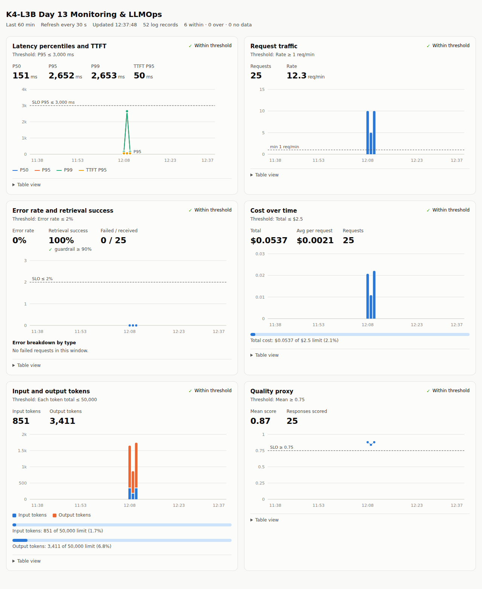
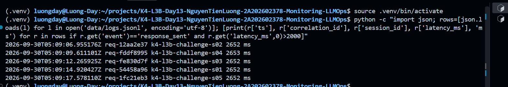
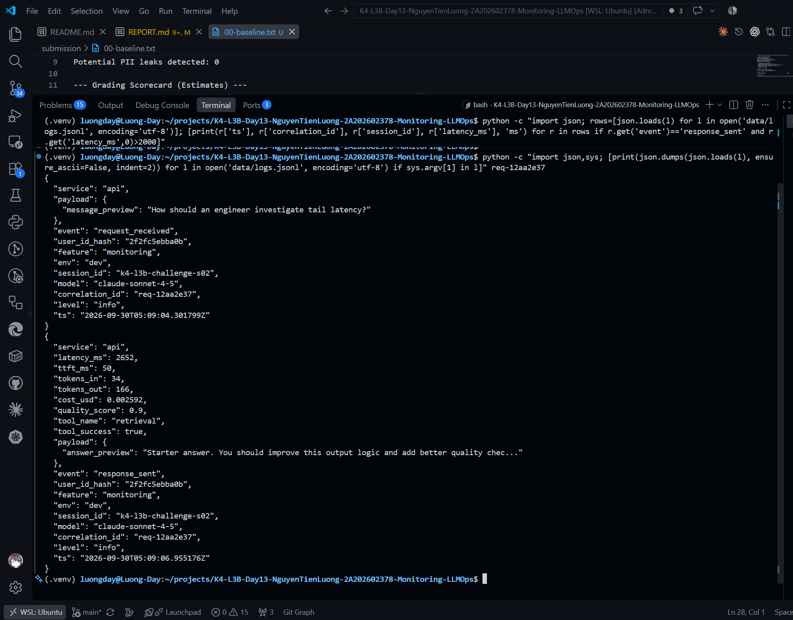
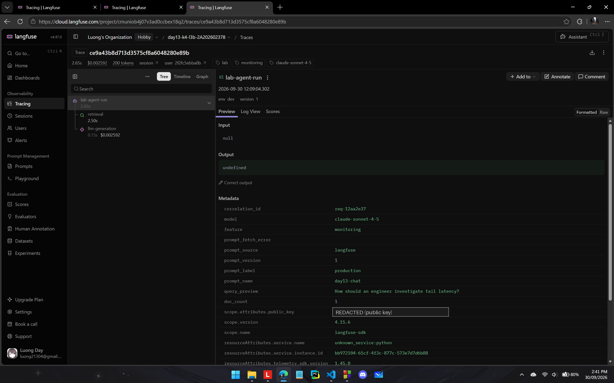

> Gợi ý cách viết ngắn, không thay cho evidence thực tế: "Metric cho thấy `[latency/error/cost/quality]` bất thường trong `[khoảng thời gian]`. Log line `[event]` có `correlation_id=[...]` đại diện cho request bị ảnh hưởng. Trace cùng `correlation_id` cho thấy span `[retrieval/generation/prompt/tool]` có dấu hiệu `[chậm/lỗi/token tăng]`. Root cause là `[nguyên nhân suy ra từ evidence]`. Fix action là `[hành động khôi phục]`; preventive measure là `[alert/runbook/test/guardrail để ngăn tái diễn]`."

## 8. Giải thích và tự đánh giá

- **Một quyết định kỹ thuật quan trọng và lý do:** scrub PII ở processor của structlog cho mọi field thay vì chỉ `payload` như code mẫu, và kiểm tra `x-request-id` trước khi tin. Lý do: `validate_logs.py` quét cả record, còn PII có thể lọt qua `error_type`, traceback hoặc chính request ID do client gửi. Đánh đổi là phải bỏ qua `ts` và `user_id_hash` để tránh che nhầm.
- **Một lỗi/blocker đã gặp:** (1) `pip install` lỗi trên Python 3.14 vì `pydantic-core` 2.33.2 không có wheel và phải build bằng Rust; tôi dựng lại `.venv` bằng Python 3.12. (2) Mạng từ WSL tới Langfuse chập chờn: prompt rơi về `local-v1`, trace không lên hoặc mất khi tắt server ngay sau request, và một request bị treo 14 giây vì DNS chặn bước lấy prompt.
- **Cách tìm nguyên nhân và xử lý:** đọc log server (`Temporary failure in name resolution`, `Failed to export spans batch`), rồi tách thử nghiệm: để server chạy khoảng 14 giây thì trace lên đủ, tắt bằng SIGTERM ngay thì mất. Từ đó tôi viết một driver giữ server chạy cho tới khi truy vấn Langfuse thấy đủ `correlation_id` với `prompt_source=langfuse` và đúng version, không đạt thì gửi lại, và loại 3 request bị ảnh hưởng khỏi evidence.
- **Cách hiểu luồng Metrics → Logs → Traces:** trong challenge, metrics cho biết triệu chứng và thời điểm: P95 tăng từ 151 lên 2653 ms trong phút 05:09 trong khi TTFT, token, cost, quality và error không đổi, nghĩa là chậm trước khi LLM bắt đầu trả lời. Log giúp chọn một request cụ thể (`req-12aa2e37`, nhận 05:09:04.301, trả 05:09:06.955). Trace cùng `correlation_id` cho thấy span `retrieval` mất 2501 ms trong 2653 ms còn `llm-generation` chỉ 151 ms. Chỉ khi ba lớp cùng chỉ về retrieval tôi mới kết luận root cause.
- **Vai trò của prompt version, token/cost, SLO hoặc rollback trong vận hành LLM:** prompt version cho biết mỗi request dùng prompt nào: v2 thêm một dòng hướng dẫn làm input token tăng từ 25 lên 36 (+44%), và nếu v2 làm hệ thống xấu đi thì chỉ cần chuyển label `production` về v1 mà không phải deploy lại. Token và cost cần theo dõi theo từng request vì tổng cost có thể chưa vượt ngân sách trong khi cost mỗi request đã tăng gấp đôi hoặc gấp ba (practice `cost_spike` đo được khoảng 0.0066 so với 0.0022 USD). SLO và error budget đặt ngưỡng chấp nhận, nhưng ngưỡng 3000 ms bỏ sót sự cố 2652 ms nên cần alert cảnh báo sớm.
- **Điều quan trọng nhất đã học:** validator và ngưỡng SLO không thay thế việc điều tra: trong sự cố, panel latency vẫn hiện "Within threshold". Phải đi từ metric sang log rồi sang trace, và evidence chỉ đáng tin khi kiểm chứng được bằng `correlation_id` (mạng lỗi và cache prompt đều có thể làm trace ghi sai version hoặc mất).
- **Hạn chế hoặc phần chưa hoàn thành, nếu có:** dashboard dùng bucket 1 phút và log chưa có `retrieval_ms` nên không thấy span chậm nếu không mở trace; `chat` là `async def` gọi code đồng bộ nên các request bị xử lý lần lượt khi retrieval chậm; bước lấy prompt có thể bị DNS chặn dù đã đặt timeout 2 giây; practice `tool_fail` và `cost_spike` chỉ kiểm tra trên dashboard và log (không có trace Langfuse tương ứng); dashboard tự viết nên chỉ chạy được cục bộ, chưa có CI hay lưu trữ dài hạn.

## 9. Checklist trước khi nộp

- [ ] Kết quả và evidence thuộc commit SHA cuối.
- [ ] Tất cả ảnh/output mở được bằng đường dẫn tương đối.
- [ ] Incident evidence nối đúng metric → log → trace.
- [ ] Trace/prompt evidence thuộc project Langfuse cá nhân và ảnh không lộ key/secret.
- [ ] Repository chạy lại được theo README.
- [ ] Không có secret, API key, PII thô hoặc evidence của người khác/lớp khác.
- [ ] URL repo và commit SHA cuối đã được nộp trên LMS/Codelabs.
